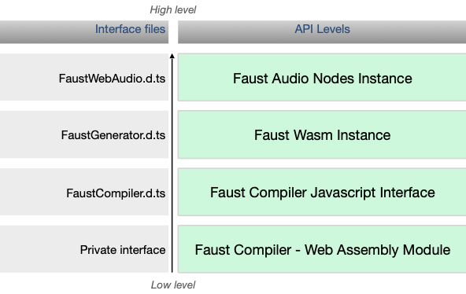

# Faust Web Audio Library

The Faust Web Audio library provides a high level Javascript API over the [Faust](https://faust.grame.fr) compiler. The interface is designed to be used with [TypeScript](https://www.typescriptlang.org/), but describes and documents the API for pure Javascript as well. This document provides an overview of the differents levels of the API. Examples of use are also provided in the `exemples`folder.

## Table of Content

-  [Organisation of the API](#org)

  - [Faust Compiler WebAssembly module](#module)
  - [Faust Compiler Javascript Interface](#compiler)
  - [Faust Wasm Instance](#wasm)
  - [Faust Audio Nodes Instances and Offline Processor ](#audio)
  - [High-level API](#high)
- [Dynamic and Static Instances](#ds)
- [Misc. services](#misc)

## Organisation of the API 

The API is organised from low to high level as illustrated by the figure below.

### Faust Compiler WebAssembly module 

The first level is the Faust compiler compiled as a wasm library named `libfaust-wasm`.
It consists in 3 different files:

- `libfaust-wasm.wasm` : the Faust compiler provided as a WebAssembly module 
- `libfaust-wasm.js` : a javascript loader of the WebAssembly module
- `libfaust-wasm.data` : a virtual file system containing the Faust libraries.

You must include `libfaust-wasm.js` in your html page. The loader will take care of providing an instance of the Faust WebAssembly module and of the associated virtual file system (libfaust-wasm.data). Note that depending on the relative location of `libfaust-wasm.js`, the loader may fail to find  `libfaust-wasm.data`; in this case, the simple solution consists in copying  `libfaust-wasm.data` aside the refering web page.

### Faust Compiler Javascript Interface 

The Faust Compiler Javascript interface is described in `FaustCompiler.d.ts`.   
It provides *classic* Faust compilation services, which output is a raw WebAssembly module with an associated JSON description of the module.

### Faust Wasm Instance 

This level takes a WebAssembly module produced by the Faust compiler or a precompiled module loaded from a file, and builds an instance of this module with the proper Wasm memory layout, ready to run, but not yet connected to any audio node.  
It is described in `FaustGenerator.d.ts`.   

### Faust Audio Nodes Instances and Offline Processor 

This level takes a Faust Wasm instance to build an audio node. [AudioWorklet](https://developer.mozilla.org/fr/docs/Web/API/AudioWorklet) and [ScriptProcessor](https://developer.mozilla.org/en-US/docs/Web/API/ScriptProcessorNode) nodes are supported.  
Note that ScriptProcessor is marked as [deprecated](https://developer.mozilla.org/en-US/docs/Web/API/ScriptProcessorNode) but it's the only audio architecture available on Safari. Both monophonic (generators, effects...) or polyphonic (instruments) nodes can be created.

**Warning**: AudioWorklet is a recent technology and may not be supported by all the browsers. Check the [compatibility](https://developer.mozilla.org/fr/docs/Web/API/AudioWorklet) chart.

An offline processor to render a DSP in a non real-time context and get the computed frames is available.

It is described in `FaustWebAudio.d.ts`.   

### High-level API 

A high-level API is available to compile a DSP program and create the audio node, either monophonic or polyphonic. It is described in `Faust2AudioNode.d.ts`.   

## Dynamic and Static Instances 

The Faust Wasm and Audio Node levels make it possible to generate instances from Faust dsp code as well as from pre-compiled WebAssembly modules.
In the latter case, it is not necessary to include the `libfaust-wasm.js` library, `FaustLibrary.js` is sufficient to provide the required services.
This allows to generate lighter and faster-loading HTML pages.

**Note**: to create a polyphonic instance from a pre-compiled WebAssembly module, an additional `mixer32.wasm` module is required and must be present at the same level as the referring HTML page. This module is part of the `dist` folder.

## Misc. services 

- `FaustUtilities.d.ts`: provides facilities to browse Faust generated SVG diagrams
- `FaustWAP.d.ts`: provides [Web Audio Plugins](https://hal.univ-cotedazur.fr/hal-01893660/document) API support.

----

